# Foundations and dissolutions of charitable organisations

## June 2020 Update

Using publicly available data collected the first week of July 2020, the following are the trends in registrations (foundations) and de-registrations (dissolutions) for the three UK charity jurisdictions:
* England and Wales
* Scotland
* Northern Ireland

There are two types of analyses presented here:
1. The monthly figures for registrations and de-registrations in 2020, compared to the average figures for 2015-2019.
2. The cumulative number of registrations and de-registrations for 2020, compared to what we expect based on trends for 2015-2019.

The former shows us whether a particular month displays much higher or lower numbers of registrations/de-registrations than is typical for that month; the latter tells us whether the total number of registrations/de-registrations is where we expect it to be based on previous years.

Finally, there are two key processes generating the observed trends:
1. Applications for registration and de-registration by charities.
2. The capacity of the regulators to process and prioritise these applications.

### England and Wales

#### Registrations

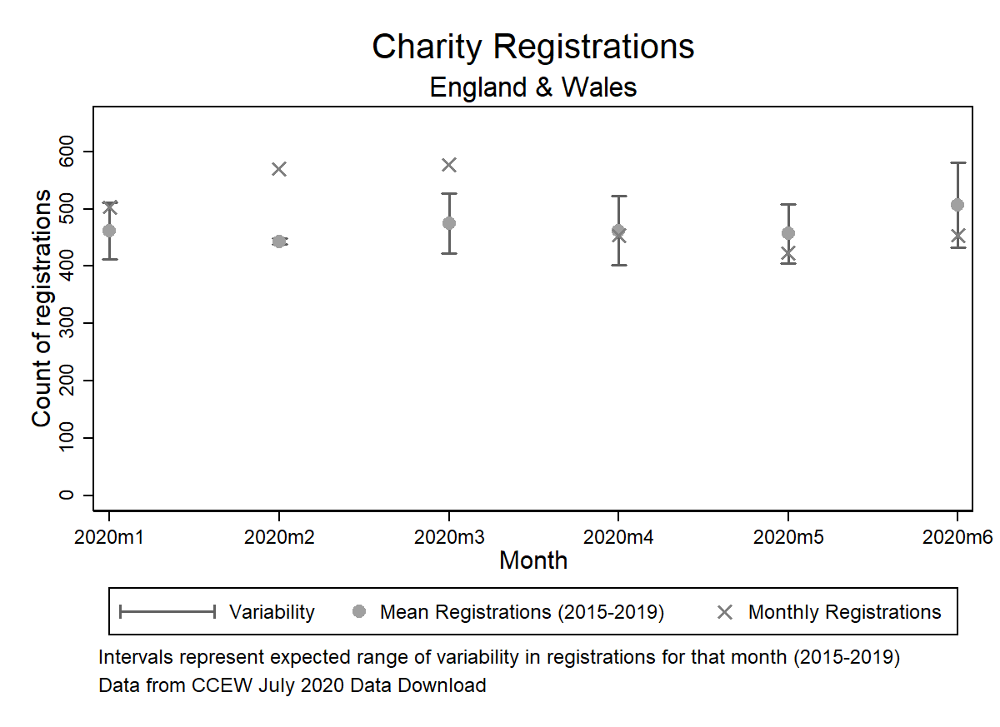

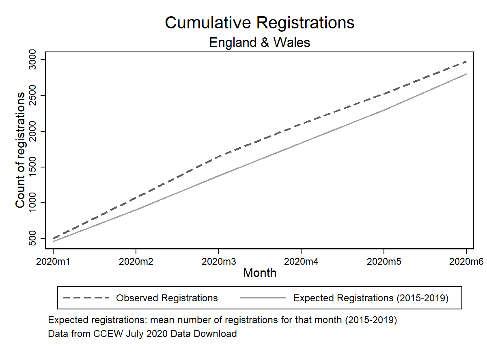

#### De-registrations

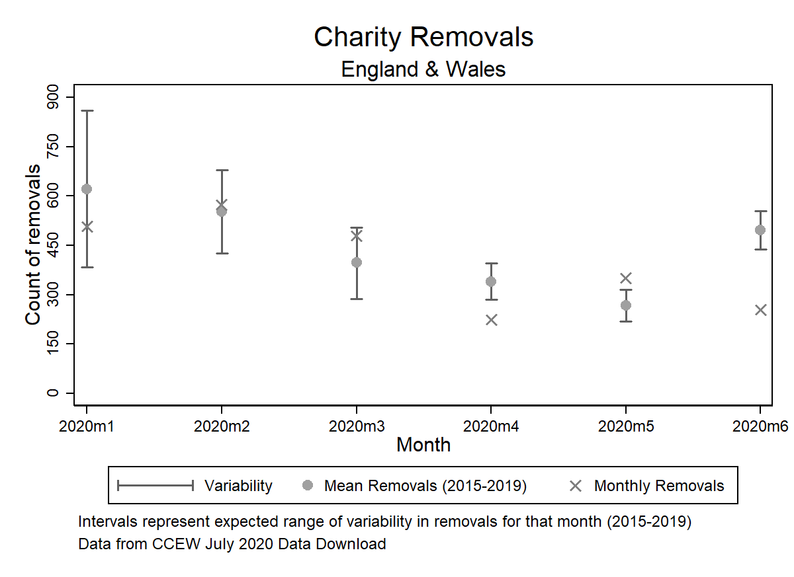

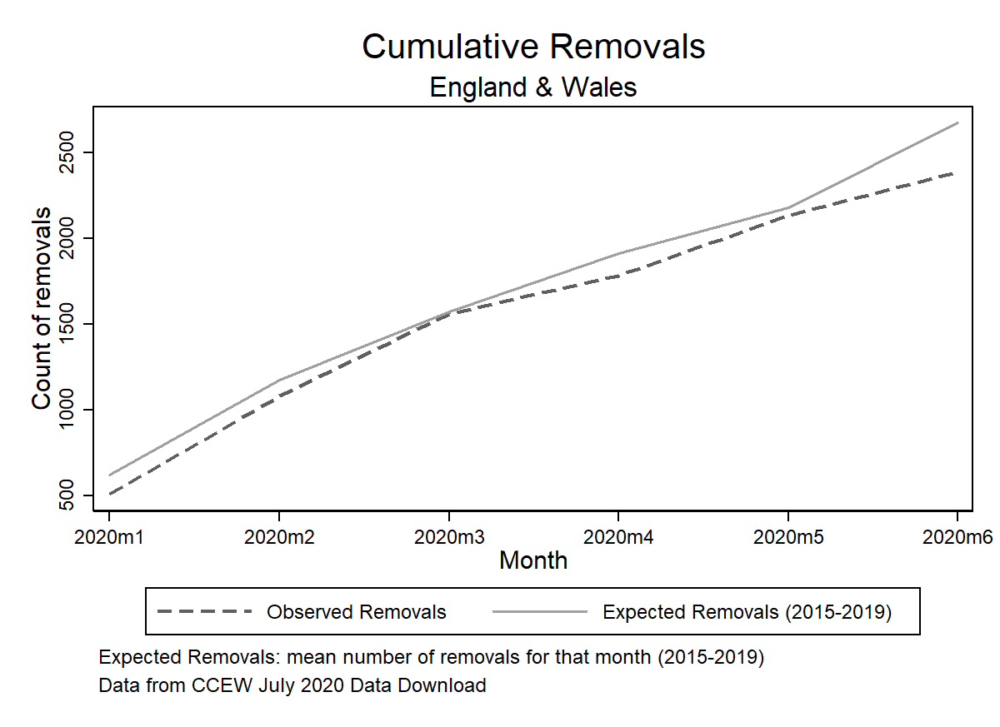

### Scotland

#### Registrations

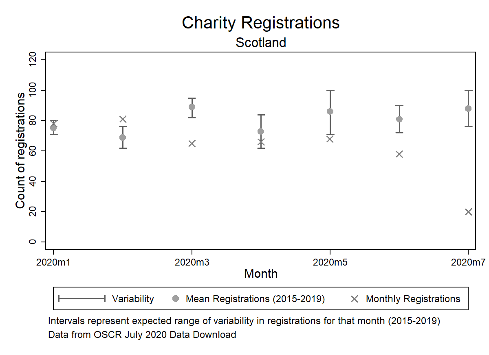

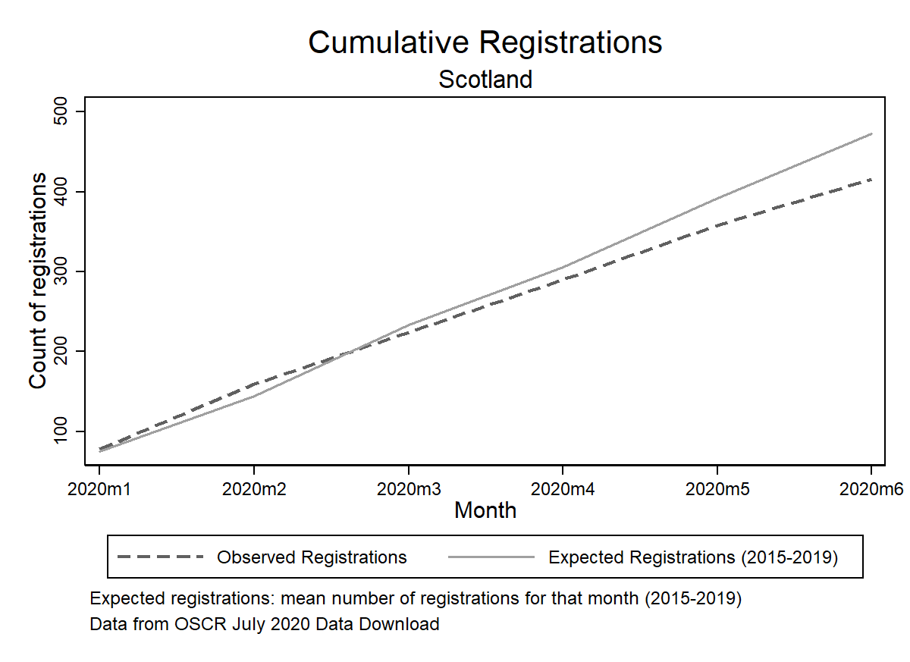

#### De-registrations

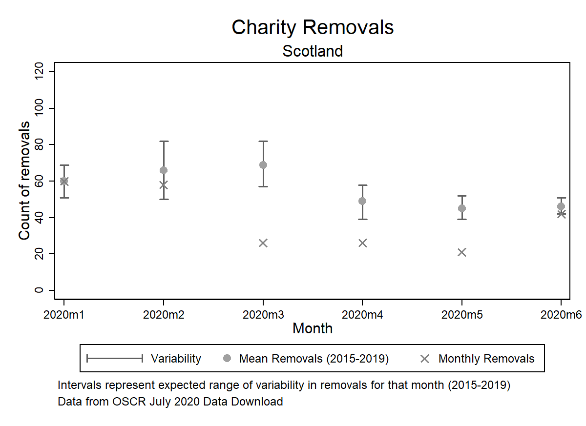

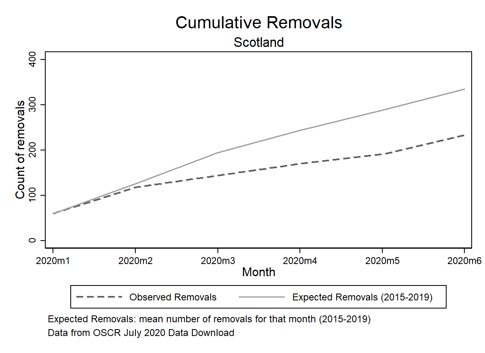

### Northern Ireland

Figures for Northern Ireland should be interpreted cautiously, for three reasons:
1. The sector is small compared to the other UK jurisdictions: monthly figures are low and hence display much more variability compared to previous periods.
2. The regulator is still undertaking work to register charities already in existence; that is, CCNI is calling charities forward in order to register with them. Thus monthly figures include new organisations being formed, and existing charities formalising their registration with the regulator. More information on the regulator's work on this task [here](https://apps.charitycommissionni.org.uk/About_us/Contacting_us/FAQs.aspx#Registration%20begins%20date?).
3. The regulator's ability and capacity to register and remove charities (as well as execute a number of other core functions) has been considerably hampered by a recent court ruling - information [here](https://www.charitycommissionni.org.uk/news/legal-update/).

#### Registrations

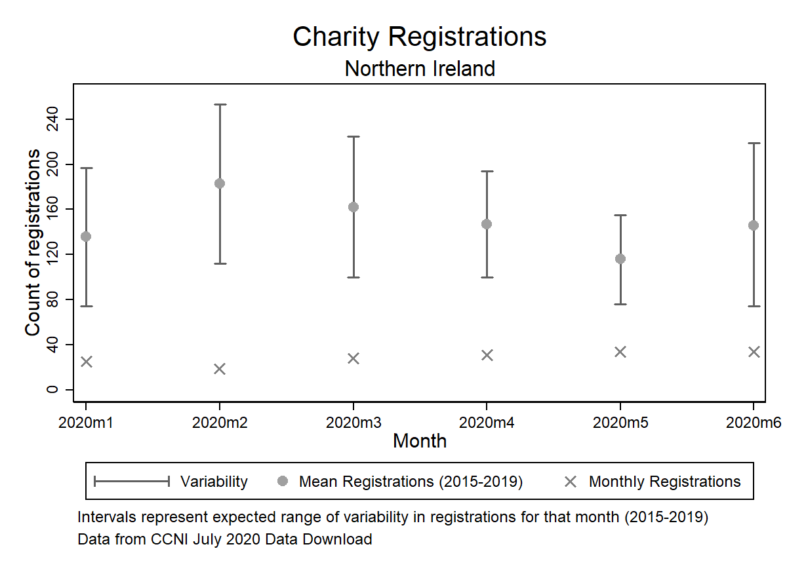

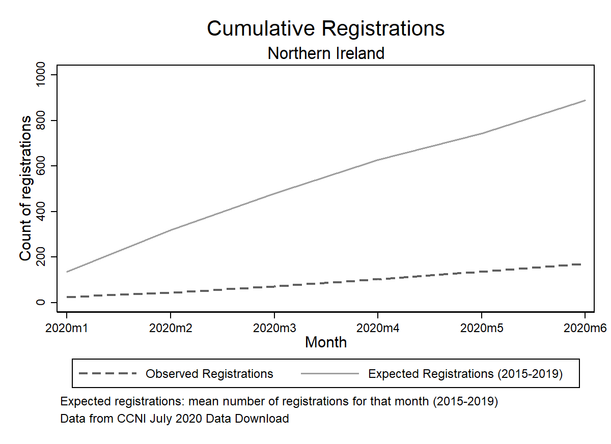

#### De-registrations

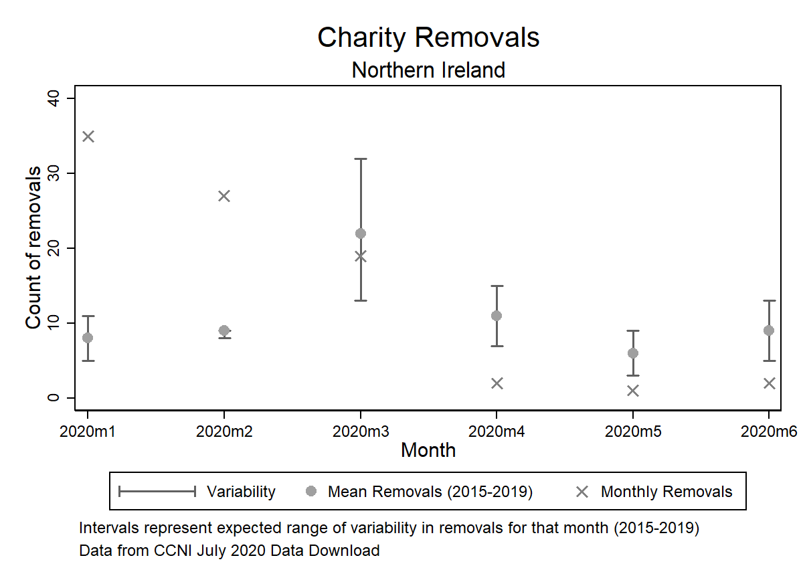

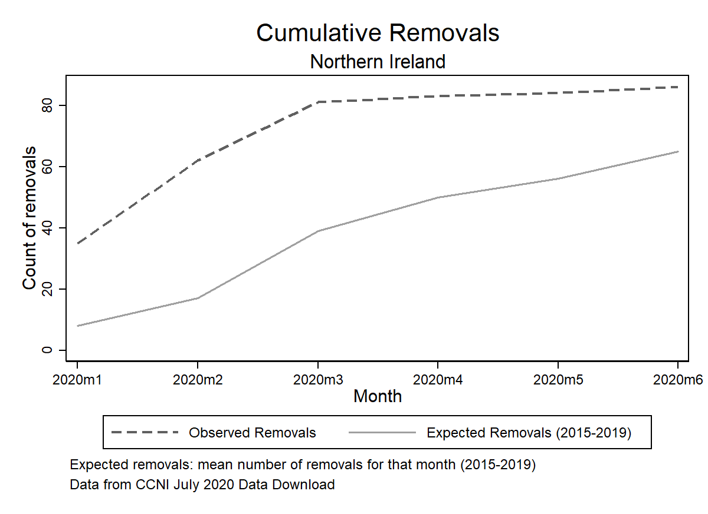